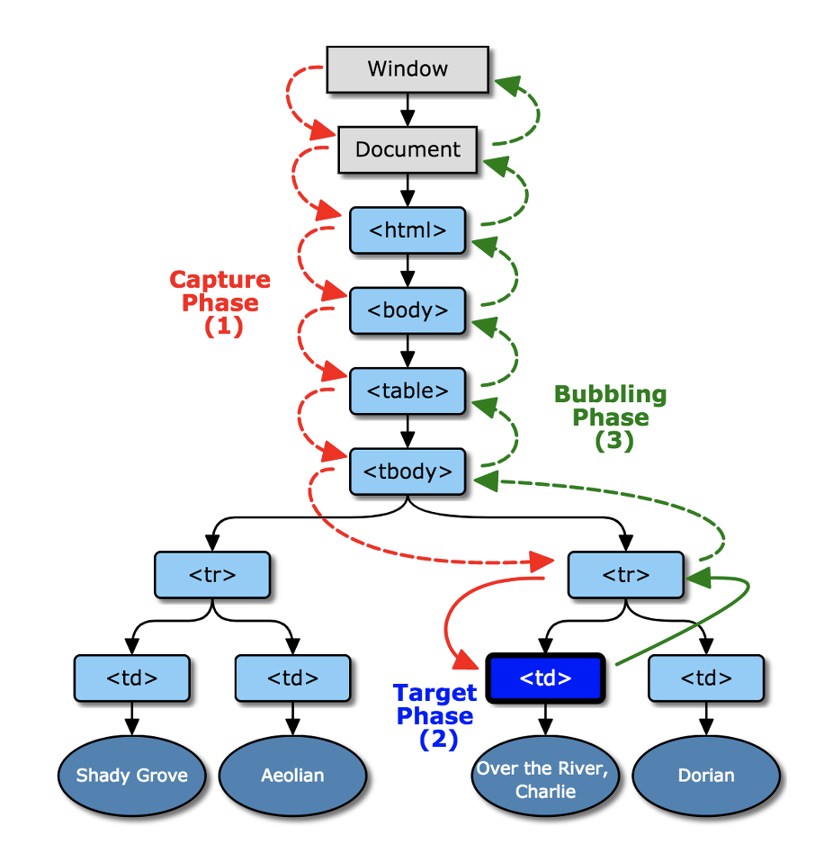

# 원쌤의 Vue.js 퀵스타트
___
## 이벤트
### 사용방법
* v-on:[이벤트이름]="표현식 or 함수명'
* v-on 디렉티브 === @  
    v-on:click === @click
* 컴포넌트 인스턴스에 등록한 이벤트 처리 함수를 사용함.
* 두 개 이상의 핸들러 실행
```html
<button @click="change1($event), change2($event)">두 개의 핸들러 실행</button>
```
### 이벤트 객체
#### 이벤트 객체의 주요 공통 속성
* target : 이벤트 발생 HTML element
* currentTarget
* path
* bubbles
* cancelable
* defaultPrevented (*)
* eventPhse
* srcElement
#### 키보드 이벤트 관련 속성
* altKey
* shiftKey
* ctrlKey
* metaKey
* key
* code
* keyCode
* charCode
#### 마우스 이벤트 관련 속성
* altKey, shiftKey, ctrlKey, metaKey
* button
* buttons
* clientX, clientY
* layerX, layerY
* offsetX, offsetY
* pageX pageY
* screenX, screenY
#### 이벤트 객체의 주요 메서드
* prevnetDefault() : 기본 이벤트 자동실행 금지
* stopPropagation() : 이벤트 전파 중지
### 기본 이벤트
* HTML 문서나 요소에 어떤 기능을 실행하도록 이미 정의 되어 있는 이벤트
* 기본 이벤트 중지 시키기 : **preventDefault()**
* 이벤트 수식어 : @contextmenu.prevent
### 이벤트 전파와 버블링
* ① 포착(capturing)
* ② 발생(raising)
* ③ 버블링(bubbling)
* 2단계, 3단계에서 연결된 이벤트 함수가 호출됨.
* 
### 이벤트 수식어
* once 수식어 : 한 번만 이벤트를 발생시키고 이벤트 연결을 해제
* 키보드 관련 수식어
  * .up .down .left .right
  * .enter .tab .delete .esc
  * .space .ctrl .alt .shift
  * .meta
  * @keyup.ctrl.enter="..."
  * @click.alt="..."
  * @keyup.ctrl.c="..."
* 마우스 관련 수식어
  * .left .right .middle
* exact
  * 단 하나의 이벤트만 실행