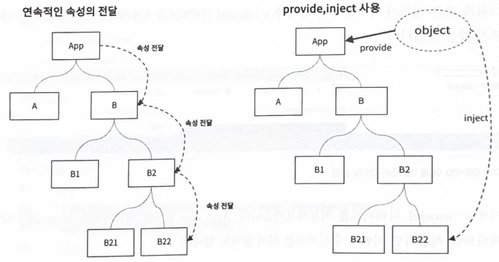

# 원쌤의 Vue.js 퀵스타트
___
## 단일 파일 컴퍼넌트에서의 스타일
* 범위 CSS (Scoped CSS)
* CSS 모듈 (CSS Module)

### 범위 CSS
* 같은 CSS 클래스 이름이 여러 컴포넌트에서 사용되면 마지막에 import된 컴포넌트의 스타일 또는 css 파일의 속성이 적용됨.
* 충돌 방지를 위해서 ```<style scoped>```를 적용함.

### CSS 모듈
* CSS 스타일을 객체처럼 다룰 수 있게 함.
* ```<style module>```을 사용함.
* 절대 충돌하지 않을 이름으로 자동 변경됨.
* ```$style```옵션에 클래스가 등록되어 있고 등록된 클래스를 마치 객체처럼 사용함.
```html
<div :class="[$style.child, $style.italic]">...</div>
```
### 슬롯
* 부모 컴포넌트와 자식 컴포넌트 사이에 template을 전달할 때 사용
```vue
<template>
  <div>
    ......
    <slot>Item</slot>
    ......
  </div>  
</template>
```
* 명명된 슬롯 (Named Slot)
  * 여러 개의 슬롯을 지정하고 각 슬롯에 필요한 컨텐츠를 전달하는 방법
  * 화면의 레이아웃을 관리할 목적으로 많이 사용됨
  * Named Slot 을 적용하면 각 컴포넌트에서는 화면 레이아웃과 관련된 문제를 고민할 필요가 없음.
* 범위 슬롯(Ranged Slot)
  * 부모 컴포넌트에서 템플릿에 데이터를 바인딩할 때 자식 컴포넌트의 데이터를 이용해 바인딩하고 싶은 경우
  * 마치 속성(props)을 전달하듯이 자식에게 부모로 부터 데이터를 전달할 수 있다. 다만 전달된 슬롯 템플릿(```<template>```) 내부 범위(scope)에서만 사용할 수 있다.
### 동적 컴포넌트
* ```<component>```요소를 템플릿에 작성하고 v-bind 디렉티브를 이용해 **is** 특성 값으로 어떤 컴포넌트를 그 위치에 나타낼지 결정하면 됨
### 컴포넌트에서의 v-model 디렉티브
* 미리 정의된 속성명과 이벤트명을 통해ㅓ 양방향 바인딩처럼 부모컴포넌트에서 사용할 수 있음.
```javascript
// 부모 컴포넌트에서
<child-component v-model:message="parentMessage" />
```
```javascript
// 자식 컴포넌트에서
{
    name: "ChildComponent", 
    props : { message: String },
    template: `<input type="text" :value="message"
        @input="$emit('update:message', $event.target.value)" />`
}
```
* 자식 컴포넌트에서는 반드시 message라는 props가 선언되어야 함.
발신(emit)하는 이벤트명은 'update:속성명'의 형식을 사용해야 함.
* 이렇게 하면 부모 컴포넌트에서 이벤트를 수신하여 부모 컴포넌트의 데이터(parnetMessage)를 변경하는 코드(method 형태)를 작성하지 않아도 됨.
### provide, inject 를 이용한 공용데이터 사용
* props : 데이터를 연속적으로 전달
* provider, inject : 데이터를 직접 전달

* provide, inject는 공용 데이터를 부모 컴포넌트(app)에 제공(provide)하고 하위 컴포넌트
 트리상의 어느 컴포넌트에서나 필요한 데이터를 주입(inject)하여 사용하도록 하는 방법
* provide로 제공되는 객체는 반응성(reactivity)을 제공하지 않음.
* 반응성 활성화 : Composition API 가 지원하는 reactive, ref, computed 를 이용
* 반응성 제공은 일반적으로 비추천. 읽기 전용으로 사용에 권장.
* 정말 필요하다면 Veux, Pinia를 사용
### 텔레포트
* 애플리케이션에서 모달, 툴팁과 같이 메인 화면과 독립적이면서 공유UI를 제공해야 할 때 사용
* 컴포넌트 트리의 계층구조와 관계없이 별도의 요소로 렌더링함
### 비동기 컴포넌트
* 컴포넌트가 사용되는 시점에 관련된 .js 파일을 로딩하기
* 프로젝트를 빌드할 때 비동기 컴포넌트를 위한 별도의 .js 파일을 분리
* 초기 화면을 위한 컴포넌트만을 로딩하므로 화면 로딩 속도가 빨라짐
* defineAsyncComponent 메소드를 사용.

[일반적인 컴포넌트의 임포트]
```typescript jsx
import SyncComponent from './SyncComponent.vue
```
[비동기 컴포넌트의 임포트]
```typescript jsx
import { defineAsyncComponent } from 'vue'

const AsyncComponent = defineAsyncComponent (
    () => import('./AsyncComponent.vue')
)
```
* defineAsyncComponent 메서드의 옵션 : [링크](https://vuejs.org/api/general.html#defineasynccomponent)