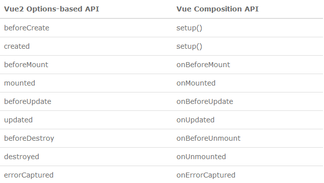

# 원쌤의 Vue.js 퀵스타트

---

## Composition API

### Composition API란?

* 대규모 Vue 애플리케이션에서의 컴포넌트 로직을 효과적으로 구성하고 재사용할 수 있도록 만든 함수 기반의 API
* 왜 필요한가?
  * 컴포넌트 내부에 동일한 논리적 관심사 코드가 분리하여 존재함.
  * 컴포넌트 로직 재사용의 불편함 해소.

### setup 메서드를 이용한 초기화

* data, methods, computed 옵션이 사라짐
* 초기화 작업 수행을 위한 setup() 옵션 메서드를 이용해서 초기화.
* api 생명 주기와 비교할 때 beforeCreate, created 단계에서 생성.
* 요소
  * 반응성 상태(reactivity)을 가진 상태 데이터
  * 계산된 속성(computed property)
  * 메서드
  * 생명주기 훅(Life cycle hook)
  * 객체 형태로 리턴

```javascript
import { ref } from "vue";

export default {
  name: "Calc",
  setup() {
    const x = ref(10);
    const y = ref(20);
    return { x, y };
  },
};
```

* 컴포넌트 컨텍스트
  * 컨텍스트는 기존 옵션 API에서 this 컨텍스트가 제공하던 정보를 setup() 내부에서 이용하기 위해 사용하는 인자

### 반응성을 가진 상태 데이터

* ref와 reactive를 이용하기
* ref
  * 기본타입(primitive type)의 값을 이용해 반응성을 가진 참조형 데이터를 생성할 때
  * 파라미터 : 초기값을 부여함.
  * 단점 : setup() 옵션 메서드 내부에서는 직접 데이터를 이용하지 못하고 value 속성을 통해서 접근함.
    * ex) x.value
* reactive
  * 객체에 대해 반응성을 가지도록 함
  * setup() 옵션 메소드 내부에서 리턴할 때는 객체 내부의 값을 사용하면 안됨.
    * ex) return { state.x, state.y } (X)

### computed

* 계산형 속성과 동일한 기능
* computed()에 의해서 생성된 계산된 속성은 템플릿에서는 직접 이용 가능
* `<script>...</script>` 내부에서 사용할 경우 `.value`를 사용해야 함.

### watch와 watchEffect

* 옵션 API의 watch 옵션과 동일한 기능

```javascript
watch(data, (current, old) => {
  // 처리하려는 연산 로직
});
```

* 첫번째 인자 : 감시하려는 대상 반응성 데이터, 속성, 계산된 속성을 전달
  * 이 값이 변경되어야 등록된 핸들러(handler) 함수가 실행된다.
* 두번째 인자 : 핸들러(handler) 함수
  * current : 변경된 값
  * old : 변경되기 전 값
* ref 혹은 reactive 를 이용한 데이터 객체라도 current와 old는 `value`에 해당함.
  * current와 old는 객체가 아닌 값이다.
* reactive 사용시 주의사항
  * 객체의 반응성 확인으로 인해 해당 메소드가 2번 실행함.
  * 감시 대상을 getter() 함수로 정의하면 해결됨.
* 배열 형태로 다중 값에 대한 감시자 설정도 가능

```javascript
watch([a1, a2, ...], ([currentA1, currentA2, ...], [oldA1, oldA2, ...]) => {

})
```

#### watchEffect

* Vue3에서 반응성 데이터 의존성을 추적하는 새로운 방법
* 반응성 데이터를 이용하는 핸들러 함수만을 지정함.
  * 핸들러 함수 내부에서 사용하는 반응성 데이터가 변경되면 자동으로 실행하도록 설정됨
* 등록한 직후에 일단 한 번 핸들러 함수를 실행하고 반응성 데이터가 변경되면 다시 실행함.
* 변경 전의 값을 알 수 없고 변경 후의 값만 알 수 있음.
  * 핸들러 함수에 인자가 없음.

```javascript
watchEffect(() => {
  // 반응성 데이터를 사용하는 코드 작성
});
```

#### 감시자 설정 해제
* watch(), watchEffect()를 호출하면 리턴되는 함수가 있는데 \
이 함수를 호출하면 감시자가 해제됨.
```javascript
handler = watchEffect( () => { ...... } )
.......
handler() // 설정되 감시자 해제
```

### 생명주기 훅(Life Cycle Hook)
* 옵션 API와 Composition API의 생명주기 메서드 차이점
  * beforeCreate(), created() 메서드의 기능을 setup()으로 대체
  * 나머지 생명주기 메서드는 앞에 on 접두어를 붙인 함수로 변경
    * updated -> onUpdated


```javascript
setup() {
  // onMounted() 만을 예시합니다.
  onMounted(() => {
    ......
  })
}
```
* 반응성 데이터의 이름을 state로 설정을 하니 마치 react와 동일한 효과를 보는 것 같음

### ```<script setup>``` 사용하기
* 단일 파일 컴포넌트 내부에서 Composition API를 사용할 때 사용.
* 장점
  * 적은 상용구(boiler plate) 코드 사용으로 간결한 코드 작성
  * 순수 타입스크립트 언어 사용 props, 이벤트 선언 가능
  * 런타임 성능 향상
  * IDE 에서의 타입 추론

#### ```<script setup>```이 기존과 다른 점
* 기존 Composition API와의 차이점
  * 템플릿에서 사용하는 값
    * 최상위의 변수, 함수는 직접 템플릿에서 사용 가능
  * 컴포넌트 등록
    * import한 컴포넌트는 바로 템플릿에서 지역 컴포넌트로 사용 가능
  * 속성과 emit 이벤트 처리
    * defineProps : 속성에 이용하는 함수
    * defineEmits : emit 함수에 사용
```javascript
// 기존 방식
setup(props, context) {
  // 이벤트를 발신할 때
  context.emit('add-todo', todo)
}
```
```javascript
// <script setup> 방식
const props = defineProps({
  todoItem : { type: Object, required: true }
})
const emit = defineEmits(['delete-todo', 'toggle-completed'])
// 이벤트를 발신할 때는 다음과 같이
emit('delete-todo', id)
```