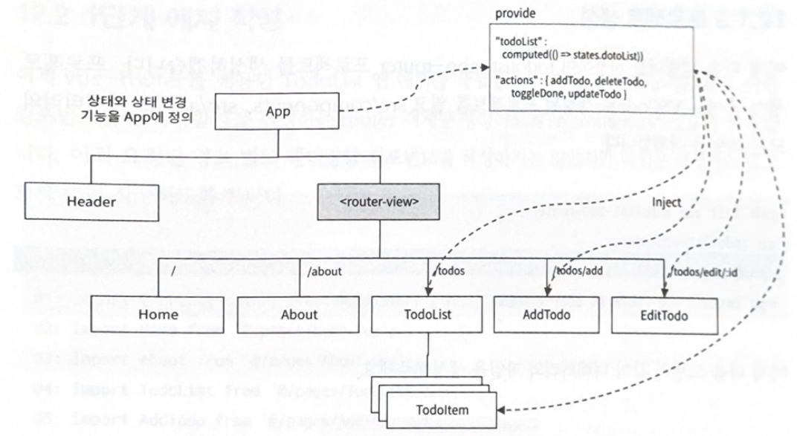

# 원쌤의 Vue.js 퀵스타트
---
## vue-router와 axios를 사용한 예제
* 1단계 : vue-router
* 2단계 : axios
* 3단계 : 비동기 호출로 인한 지연시간 화면(스피너 UI) 변경

### 애플리케이션 아키텍쳐와 프로젝트 생성
* /home : 화면 제목
* /about : 화면 제목
* /todos : 할일 목록(TodoList)
* /todos/add : 추가화면
* /todos/edit/:id : 편집화면

* 컴포넌트 계층 구조
  * App 컴포넌트에서 상태와 상태 변경 기능 정의
    * provide / inject 를 이용 → 자식 컴포넌트에서 상태를 직접 사용
    * 속성을 통한 전달 반복 방지
  * 상태 변경 기능
    * addTodo
    * updateTodo
    * deleteTodo
    * toggleDone \
  

