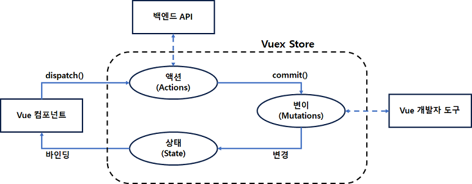
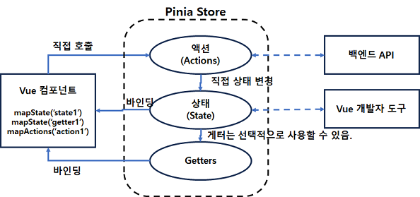
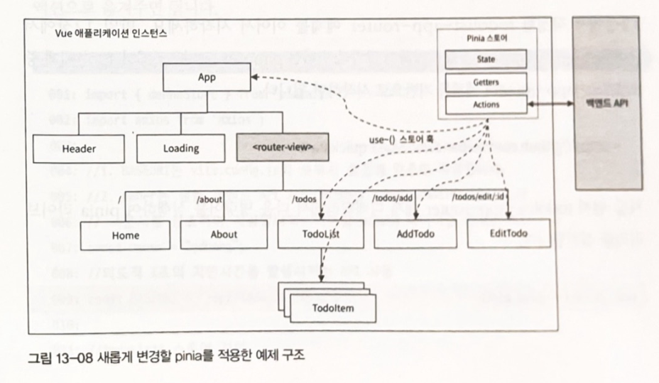

# 원쌤의 Vue.js 퀵스타트
---
## pinia 를 이용한 상태 관리
* Composition API 방식으로 Vue 애플리케이션을 위한 중앙 집중화된 상태 관리 기능을 제공하도록 설계된 라이브러리
* Vue 애플리케이션을 위한 공식 상태 관리 라이브러리
* Pinia is now the new default. The official state management library for Vue has changed to Pinia.

### pinia와 vuex를 비교하기
* pinia는 vuex보다 더 간단한 구조
  * vuex
    * 스토어라는 객체를 가짐
    * state, mutations, action, dispatch() 메소드
    * 스토어 내부에 상태(state), 상태를 변경하기 위한 변이(mutations), 컴포넌트에서 호출하기 위한 액션(action)
    * dispatch()메소드를 이용한 액션 타입과 페이로드를 전달
    * commit()으로 변이 호출
  * pinia
    * 스토어 내부에 액션과 생태만 정의
    * 액션 메서드를 직접 호출
    * 액션에서 상태를 직접 변경
```javascript
this.$store.dispatch("addTodo", { todo: this.todo, done: false })
```


**[Vuex의 옵션 API 방식의 스토어 생성]**
```javascript
const store = createStore({
  state: { count: 0 },
  mutations: {
    increment (state, payload: { num }) {
      state.count += payload.num  
    }
  },
  actions: {
    increment(context, { num }) {
      context.commit('increment', { num : num })  
    }  
  }  
})
```

* pinia는 다중 스토어를 지원함.
* pinia는 Composition API를 지원함.
* 타입스크리브 지원이 vuex보다 강함
* pinia는 vuex에 비해 가볍다.

### pinia 아키텍처와 구성 요소
1. 스토어 정의하기
2. pinia를 사용하도록 Vue애플리케이션 인스턴스 설정
3. 각각의 컴포넌트에서 스토어 사용하기

#### pinia 아키텍처

* 옵션 API의 경우 mapState, mapActions와 같은 유틸리티 함수를 이용함.

#### 스토어 정의하기
* defineStore() 함수 이용
  * 첫 번째 인자 : StoreName, 개발자 도구에서 식별하는데 사용
  * 두 번째 인자
    * 객체타입 전달 : 옵션 API 방식. 상태와 액션을 정의함.
    * 함수타입 전달 : Composition API 의 Setup 함수 처럼 작성. 
      * reactive(), ref()를 이용해 상태 정의.
      * computed()를 이용해 반응성 읽기 전용의 값을 정의
```javascript
import { defineStore } from 'pinia'
import { reactive, computed } from 'vue'

// [ 옵션 API 방법 적용]
export const useCount1Store = defineStore('count1', {
  state: () => ({
    count: 0  
  }),
  actions: {
    increment({num}) {
      this.count += num  
    }  
  }  
})

// [컴포지션 API 방법 적용]
export const useCount2Store = defineStore('count2', () => {
  const state = reactive({ count : 0 })
  const increment = ({num}) => {
    state.count += num
  }
  const count = computed(() => state.count)
  return { count, increment }  
})
```
#### pinia를 사용하도록 Vue 애플리케이션 인스턴스 설정
```javascript
// main.js
import { createApp } from 'vue'
import App from './App.vue'
import './assets/main.css'
import { createPinia } from 'pinia'

const pinia = createPinia()
const app = createApp(app)

app.use(pinia)
app.mount('#app')
```

#### 컴포넌트에서 스토어 사용
* 옵션 API
  * 스토어의 상태, 액션을 이용하는 방법 : mapState, mapActions 함수 이용
  * mapState : 스토어의 상태와 게터를 컴포넌트의 계산된 속성(Computed Property)에 지정하는 형식의 객체를 생성
  * mapActions : 스토어의 액션을 컴포넌트의 메서드에 지정하는 형식의 객체를 생성
  * 기존의 계산된 속성, 메서드와 결합해야 하므로 전개 연산자(...) 를 자주 사용하기

[옵션 API를 사용한 컴포넌트에서의 스토어 사용]
```javascript
<script>
  import { useCount1Store } from '@/store/counter.js'
  import { mapState, mapActions } from 'pinia'
  
  export default {
    name: "App",
    computed: {
      ...mapState(useCount1Store, ['count'])    
    },
    methods : {
      ...mapActions(useCount1Store, ['increment'])    
    }    
  }
</script>
```
* 컴포지션 API
  * defineStore()함수에서 리턴된 훅 형태의 함수를 호출
  * 상태 데이터는 반응성 유지를 위해 computed()를 이용해야 한다.
[컴포지션 API를 사용한 컴포넌트에서의 스토어 사용]
```javascript
<script>
  import { useCount1Store } from '@/store/counter.js'
  import { computed } from 'vue'
  
  export default {
    setup() {
      const store = useCount1Store()
      const count = computed(() => store.count)
      const increment = store.increment
      
      return { count, increment }  
    }  
  }
</script>
```
### todolist-app-router 예제에 pinia 적용하기

